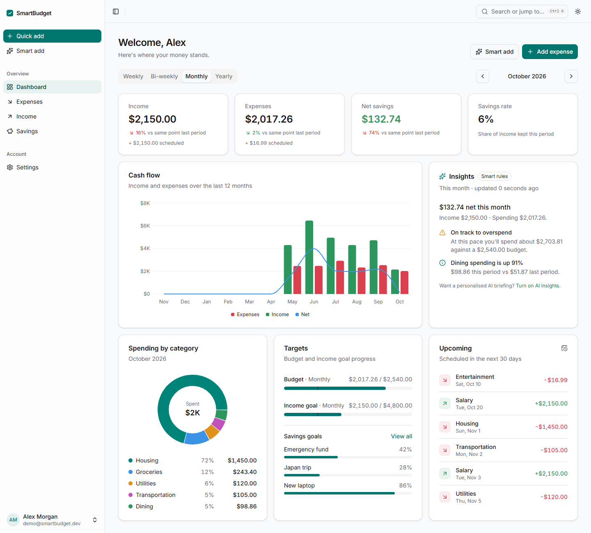
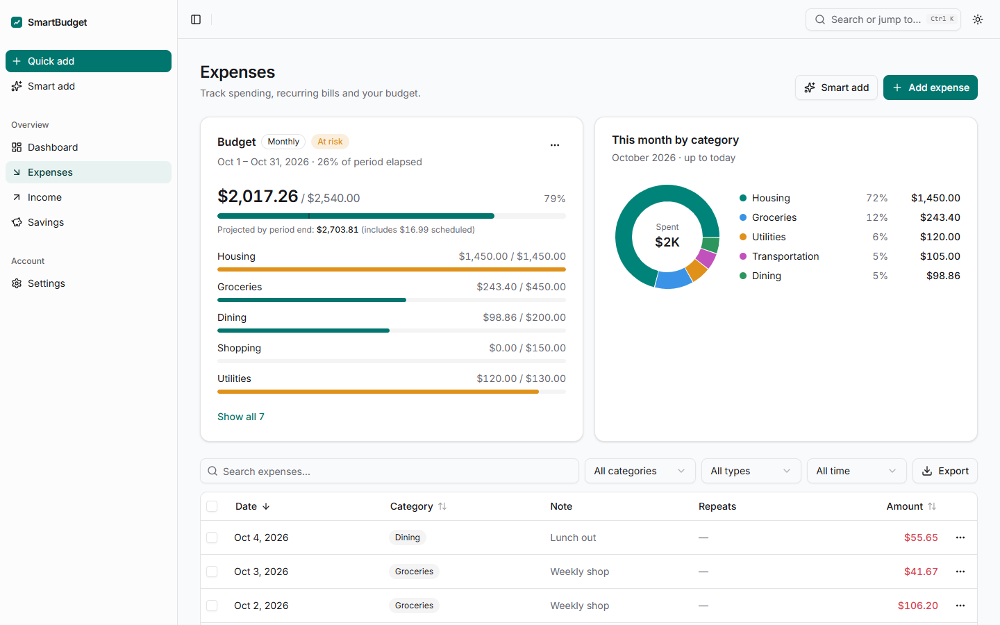
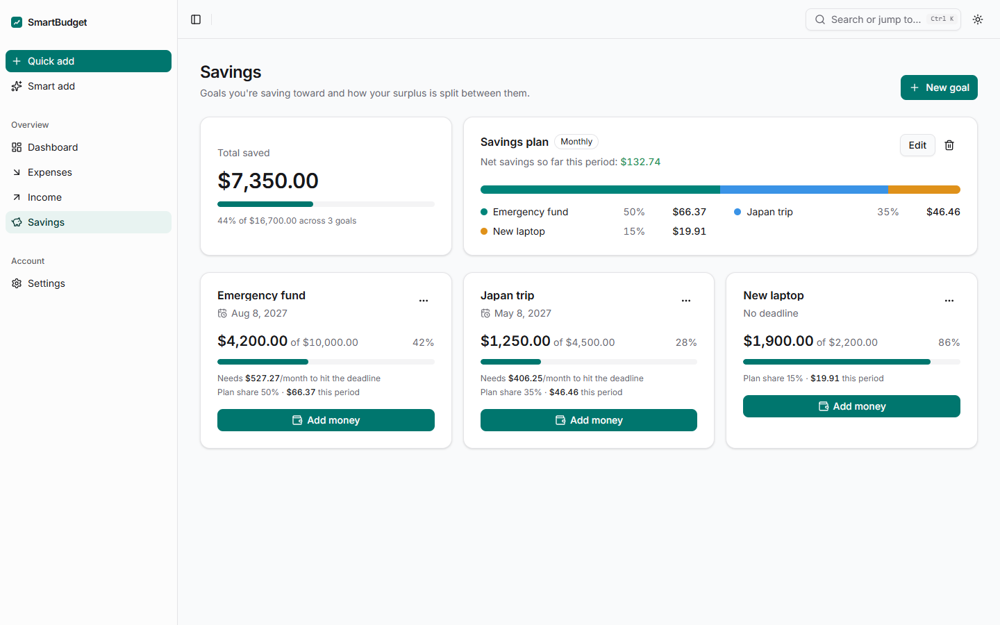
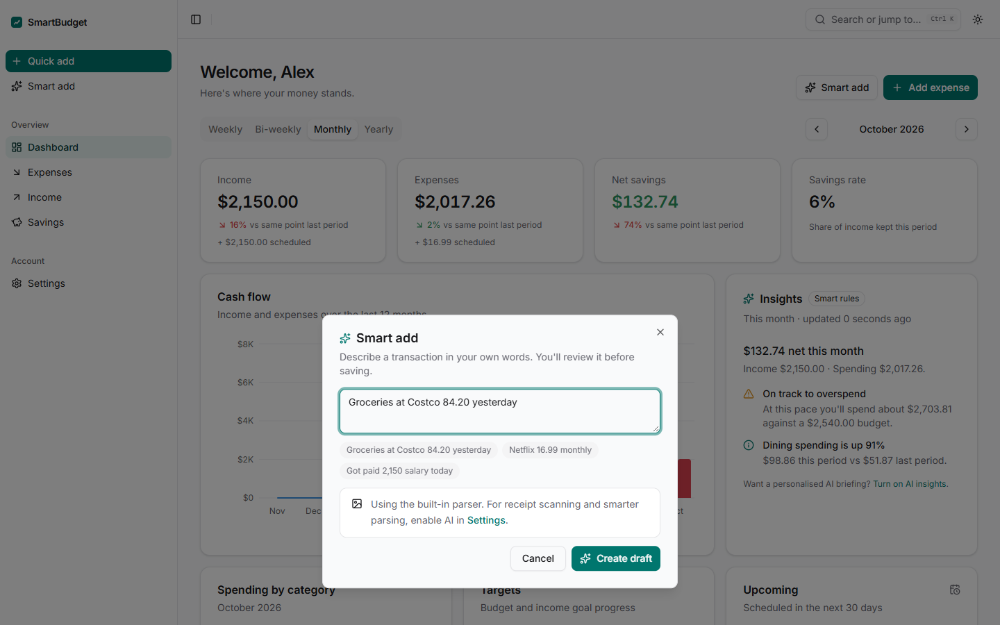
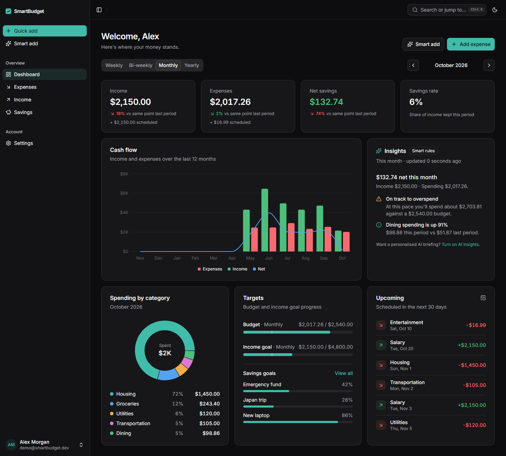
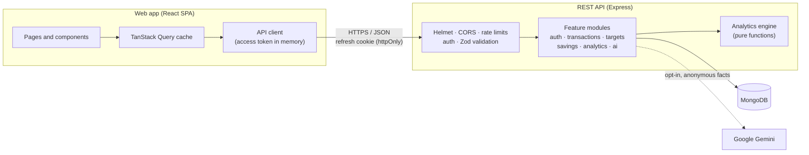

<div align="center">


# SmartBudget

**Personal finance, made clear.**
Track spending and income, plan budgets, save toward goals and get plain-language insights,<br />
with optional AI that helps without ever being required.

[](https://github.com/PrthD/SmartBudgetAI/actions/workflows/ci.yml)
[](LICENSE)

[](https://react.dev)
[](https://vite.dev)
[](https://tailwindcss.com)
[](https://ui.shadcn.com)
[](https://nodejs.org)
[](https://expressjs.com)
[](https://www.mongodb.com)
[](https://zod.dev)
[](https://ai.google.dev)
[](https://vitest.dev)

[**Live app**](https://smartbudget-frontend.onrender.com) · [Features](#features) · [Getting started](#getting-started) · [Architecture](#architecture)

</div>

<br />

<picture>
  <source media="(prefers-color-scheme: dark)" srcset="docs/screenshots/dashboard-dark.png" />
  
</picture>

## Table of contents

- [About](#about)
- [Features](#features)
- [Screenshots](#screenshots)
- [Tech stack](#tech-stack)
- [Architecture](#architecture)
- [Project structure](#project-structure)
- [Getting started](#getting-started)
- [Configuration](#configuration)
- [Testing and quality](#testing-and-quality)
- [Security and privacy](#security-and-privacy)
- [License](#license)

## About

SmartBudget brings everyday money management into a single, focused workspace. Log one-off and recurring transactions, set budgets and income goals for any period, and save toward goals with a plan that splits each period's surplus between them. The dashboard compares where you are with the same point last period and projects where you are likely to finish, so you can adjust before the month is over.

AI is an optional layer on top. It can turn a short note or a receipt photo into a draft transaction and write a brief monthly summary. Every AI feature has a built-in, rule-based fallback, so the app stays fully usable without an API key, when a free-tier quota runs out, or when a user chooses not to opt in.

## Features

### Money tracking

- **Expenses and income**: one-off and recurring entries (weekly, bi-weekly, monthly, yearly), with the option to skip or restore a single occurrence.
- **Organised data**: search, filter, sort and paginate, with the current view kept in the URL so it can be bookmarked or shared.
- **Housekeeping**: rename a category everywhere at once, bulk delete with undo, and export to CSV.

### Planning

- **Budgets and income goals**: per-category targets for any period, with an "even pace" marker and an end-of-period projection.
- **Suggest from history**: fills in targets from your recent spending and earnings.
- **Savings goals**: contributions and withdrawals, the monthly pace needed to meet each deadline, and a savings plan that shares out each period's net savings.

### Insights

- **Dashboard**: income, expenses, net savings and savings rate compared like-for-like with the previous period, plus a 12-month cash-flow chart, spending breakdown, upcoming bills and goal progress.
- **Any time frame**: browse by week, fortnight, month or year, and step back through previous periods.

### AI assistance (optional)

- **Smart Add**: _"Groceries at Costco 84.20 yesterday"_ or a receipt photo becomes a draft transaction you review before saving.
- **Monthly briefing**: a short summary of trends, risks and suggested next steps, based only on figures calculated by the app.
- **Graceful fallback**: a built-in parser and rule engine take over whenever AI is unavailable or switched off.

### Experience

- Light, dark and system themes, a <kbd>Ctrl</kbd> / <kbd>⌘</kbd> + <kbd>K</kbd> command menu and guided onboarding.
- Responsive from phones to wide screens, built on accessible Radix primitives.
- Profile photo, per-user currency and time zone, full data export and self-service account deletion.

## Screenshots

<table>
  <tr>
    <td width="50%"></td>
    <td width="50%"></td>
  </tr>
  <tr>
    <td align="center"><sub><b>Expenses</b>: budget progress, category breakdown and transactions</sub></td>
    <td align="center"><sub><b>Savings</b>: goals, required pace and the savings plan</sub></td>
  </tr>
  <tr>
    <td width="50%"></td>
    <td width="50%"></td>
  </tr>
  <tr>
    <td align="center"><sub><b>Smart Add</b>: describe a transaction in plain words</sub></td>
    <td align="center"><sub><b>Dark mode</b>: the full dashboard</sub></td>
  </tr>
</table>

## Tech stack

| Area         | Technologies                                                                                                    |
| ------------ | --------------------------------------------------------------------------------------------------------------- |
| **Frontend** | React, Vite, React Router, TanStack Query, TanStack Table, React Hook Form                                      |
| **UI**       | Tailwind CSS, shadcn/ui (Radix), Recharts, Lucide icons, Sonner                                                 |
| **Backend**  | Node.js, Express, Mongoose, Zod, Pino                                                                           |
| **Security** | Helmet, CORS allow-list, express-rate-limit, JWT access tokens with rotating refresh sessions, bcrypt           |
| **AI**       | Google Gemini via the Google Gen AI SDK, with schema-validated output and rule-based fallbacks                  |
| **Data**     | MongoDB (Atlas in production, Docker locally)                                                                   |
| **Quality**  | Vitest, Testing Library, Supertest, mongodb-memory-server, ESLint, Prettier, GitHub Actions, gitleaks           |

## Architecture



- **Frontend**: a single-page app split by feature. Routes are lazy-loaded, server state lives in TanStack Query, and tables and filters keep their state in the URL.
- **Backend**: feature modules, each with its own routes and service, on a shared middleware stack. Every request is validated with Zod before it reaches a service.
- **Analytics**: recurrences, periods and projections are computed by a pure, unit-tested engine that works on calendar dates in the user's own time zone.
- **AI**: Gemini receives a compact, anonymous fact sheet, never raw records. Its responses are checked against a schema, cached, and replaced by deterministic logic on any failure.

## Project structure

```
SmartBudgetAI/
├── backend/                  REST API
│   ├── server.js             Entry point: database connection, startup, graceful shutdown
│   ├── src/
│   │   ├── app.js            Middleware stack and route wiring
│   │   ├── config/           Validated environment, logger, database
│   │   ├── lib/              Calendar dates, recurrence, periods, money, errors, shared schemas
│   │   ├── middleware/       Authentication, validation, rate limiting, error handling
│   │   ├── models/           Mongoose models
│   │   └── modules/
│   │       ├── auth/         Sign-up, sign-in, rotating refresh sessions
│   │       ├── users/        Profile, preferences, avatar, export, account deletion
│   │       ├── transactions/ Shared CRUD for expenses and income
│   │       ├── targets/      Budgets and income goals
│   │       ├── savings/      Goals, contributions, savings plan
│   │       ├── analytics/    Analytics engine and dashboard summary
│   │       └── ai/           Gemini client, fact sheet, rules, fallback parser
│   ├── scripts/              Demo data seeding and in-memory dev server
│   └── tests/                Unit and integration tests
├── frontend/                 React web app
│   └── src/
│       ├── components/       UI primitives, shared components, layout, charts
│       ├── features/         auth, dashboard, transactions, targets, savings, ai, settings
│       └── lib/              API client, query client, formatting, dates, CSV, images
├── scripts/                  Cross-platform development tasks (used by the Makefile)
├── docs/screenshots/         Images used in this README
├── docker-compose.yml        Local MongoDB
└── Makefile                  Developer commands
```

## Getting started

### Prerequisites

- [Node.js](https://nodejs.org/) (current LTS)
- [Docker](https://www.docker.com/) for the local database, or use the in-memory option below

### Quick start

```bash
git clone https://github.com/PrthD/SmartBudgetAI.git
cd SmartBudgetAI

make setup     # install dependencies for both apps
make env       # create local .env files from the examples
make db-up     # start MongoDB in Docker
make seed      # add the demo account
make dev       # API on http://localhost:5000, web app on http://localhost:3000
```

Open [localhost:3000](http://localhost:3000) and sign in with **demo@smartbudget.dev** / **demo1234**.

> [!TIP]
> No Docker? Skip `make db-up` and `make seed`, and run `make dev-memory` and `make dev-web` in two terminals instead of `make dev`. The API then uses a temporary in-memory database that is already filled with demo data.

### Common commands

| Command                           | Description                                         |
| --------------------------------- | --------------------------------------------------- |
| `make dev`                        | Run the API and web app together with hot reload    |
| `make dev-api` / `make dev-web`   | Run one side only                                   |
| `make test`                       | Run all backend and frontend tests                  |
| `make lint` / `make format`       | Lint and format the codebase                        |
| `make build` / `make preview`     | Build the web app for production and preview it     |
| `make db-reset`                   | Wipe the local database and re-seed the demo data   |
| `make db-shell`                   | Open a MongoDB shell on the local database          |
| `make`                            | List every available command                        |

<details>
<summary><b>Using Windows without GNU make?</b></summary>
<br />

All tasks live in a cross-platform Node script, so GNU make isn't required:

- Run `npm run make:install` once to add a `make` command for PowerShell, Command Prompt and Git Bash ([details](scripts/make-shim/README.md)), or
- call tasks directly, for example `npm run dev` or `node scripts/dev.mjs dev`.

</details>

## Configuration

Each app reads a local `.env` file created by `make env`. The `.env.example` files document every option.

| Variable                     | App      | Description                                                                         |
| ---------------------------- | -------- | ----------------------------------------------------------------------------------- |
| `MONGODB_URI`                | backend  | MongoDB connection string                                                           |
| `JWT_SECRET`                 | backend  | Signing secret for access tokens (at least 32 random characters)                    |
| `CORS_ORIGINS`               | backend  | Comma-separated list of web origins allowed to call the API                         |
| `GEMINI_API_KEY`             | backend  | Optional. Enables AI features ([free key](https://aistudio.google.com/apikey))      |
| `AI_DAILY_REQUESTS_PER_USER` | backend  | Optional. Per-user daily AI request limit                                           |
| `VITE_API_URL`               | frontend | API base URL. Leave empty locally: the dev server proxies `/api` to the backend.    |

> [!NOTE]
> The seed script only runs against a local database, and real credentials never belong in `.env` files committed to the repository.

## Testing and quality

```bash
make test      # backend: unit + integration tests on an in-memory MongoDB; frontend: component and utility tests
make lint      # ESLint across both apps
```

Every push and pull request runs the [CI workflow](.github/workflows/ci.yml): linting and tests for both apps, a production build with a check that no secrets reach the bundle, a dependency audit, and a [gitleaks](https://github.com/gitleaks/gitleaks) scan of the full history.

## Security and privacy

- **Sessions**: short-lived access tokens are kept in memory only. Refresh tokens are opaque, stored hashed, delivered in an `httpOnly` cookie, rotated on every use, and a reused token revokes the whole session family.
- **Input handling**: every request body, query and route parameter is validated with Zod, and errors never expose internal details.
- **Abuse protection**: rate limits on the API, sign-in and AI endpoints, strict CORS with an Origin check on the authentication endpoints, and per-route body size limits.
- **Hardening**: Helmet security headers, verified image uploads, CSV formula-injection protection, and re-authentication for sensitive account changes.
- **AI privacy**: AI is opt-in per user. Only anonymous, aggregated figures are sent, never names, emails or notes, and results are cached to keep usage low.

## License

Distributed under the MIT License. See [LICENSE](LICENSE) for details.
